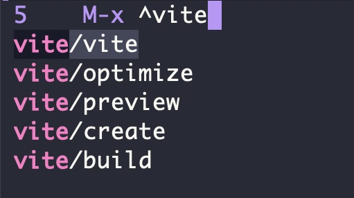
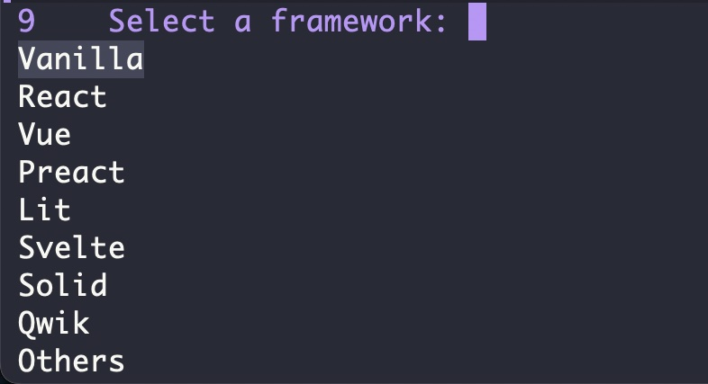
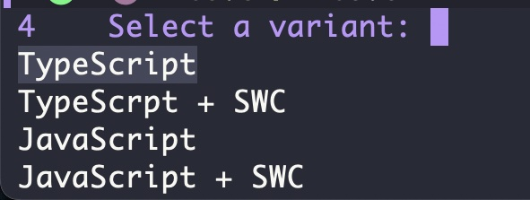
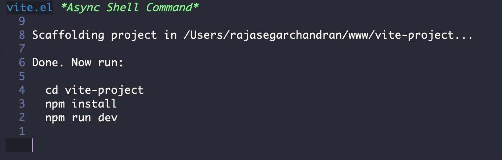

# vite.el
An Emacs plugin to work with [Vite](https://vitejs.dev/) - the next generation frontend tooling


vite.el is an Emacs plugin to work with the Vite - the next generation frontend tooling using which you can create Vite projects within Emacs without opening a new shell


## Installation
Download the package into your Emacs directory
```
git clone https://github.com/rajasegar/vite.el.git ~/.emacs.d/elpa
```

Use `use-package` to install the package
```elisp
(use-package vite
  :load-path "elpa/vite.el/")
```

## Usage
To create new Vite projects
```elisp
(vite/create)
```

You can run the interactive functions using `M-x`


First it will ask you the name of the project you want to create


Next choose the directory where you want to create the new project


Choose your JavaScript framework:


Next choose the variant, whether JavaScript or TypeScript



Finall the vite create command is run and the command output will
be displayed in a separte buffer



To run vite in the current project/directory
```elisp
(vite/run)
```

To run vite build in the current project/directory
```elisp
(vite/build)
```

Other functions available:
```elisp
(vite/optimize)
(vite/preview)
```
